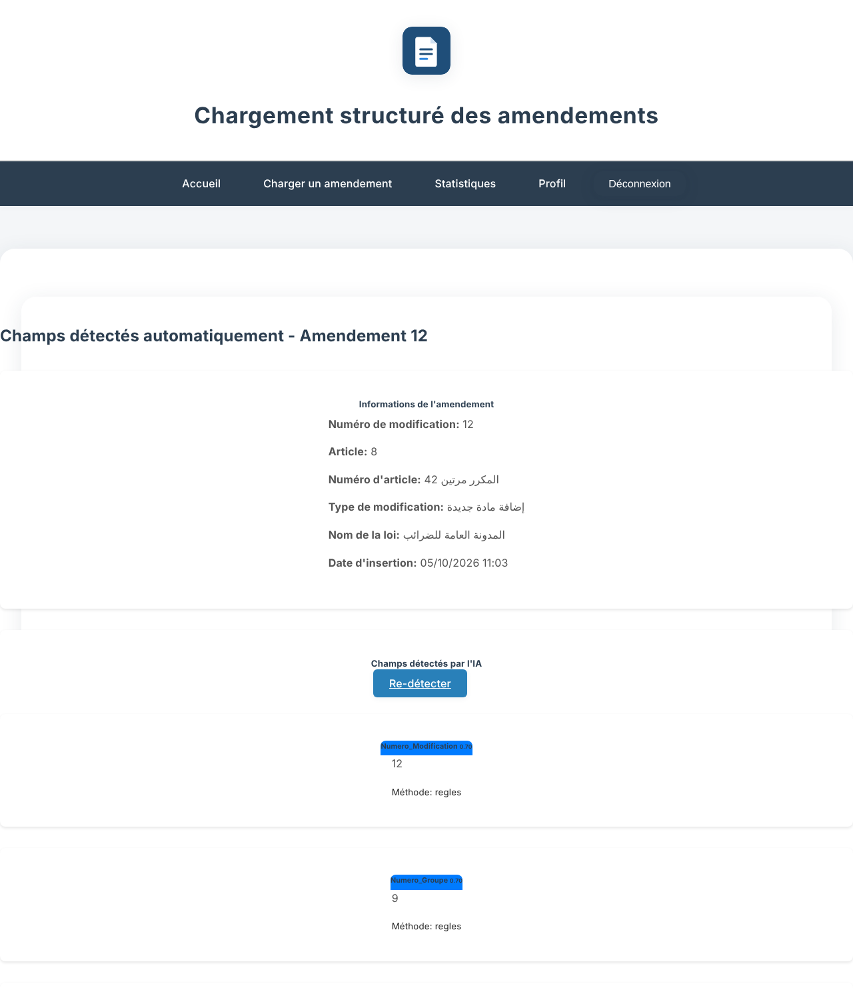
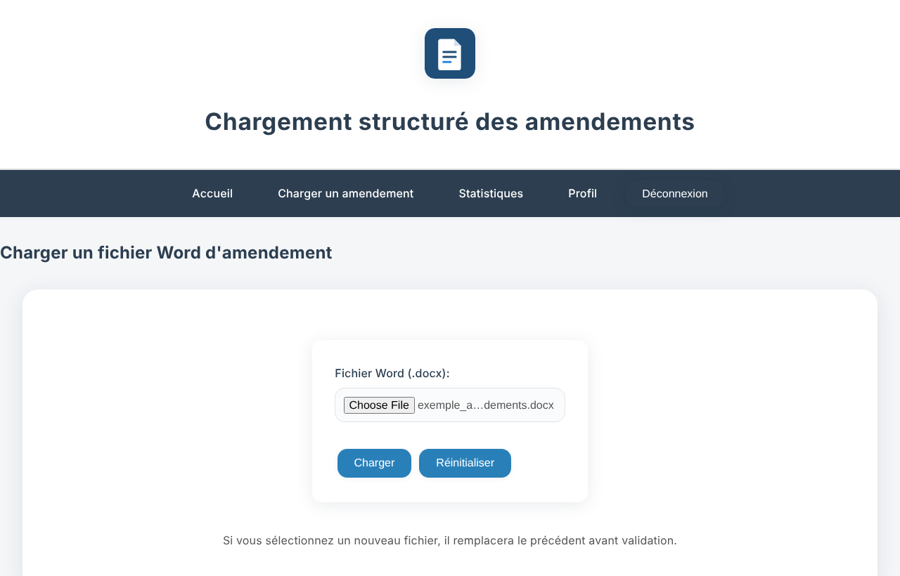
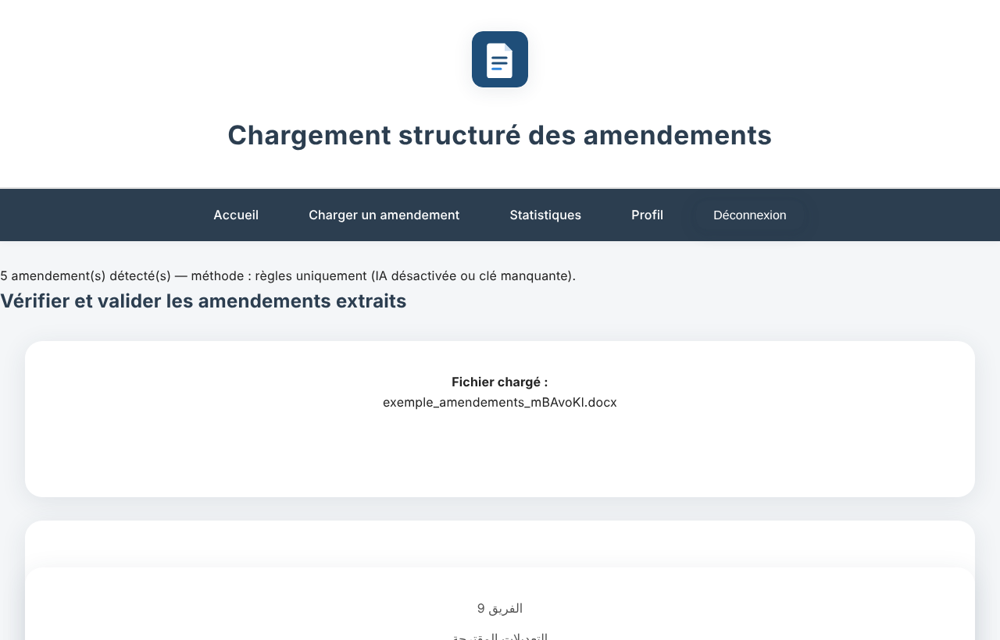
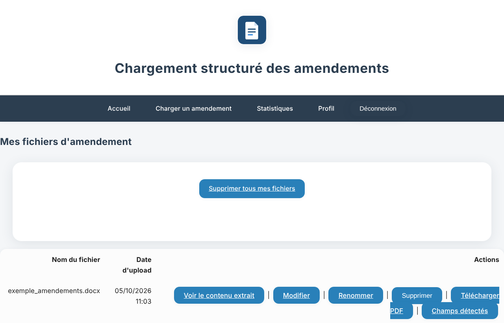
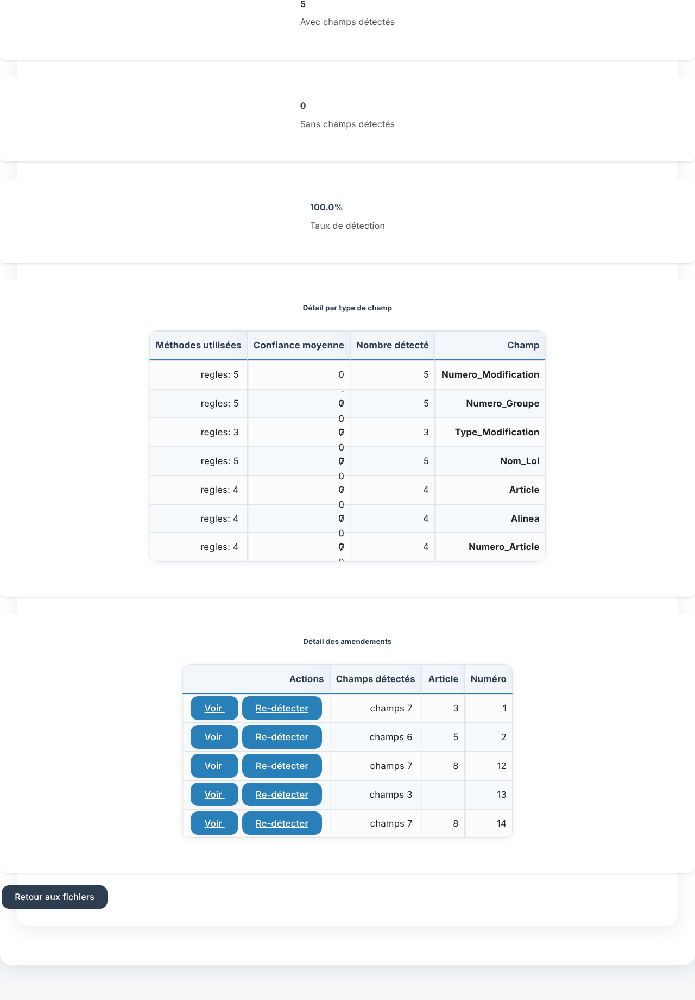
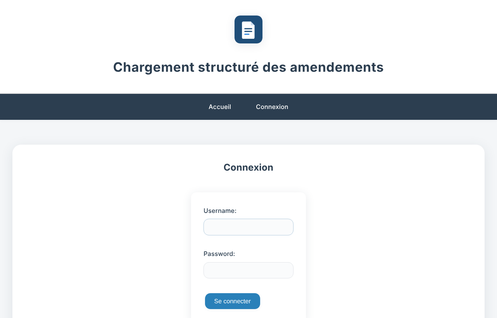
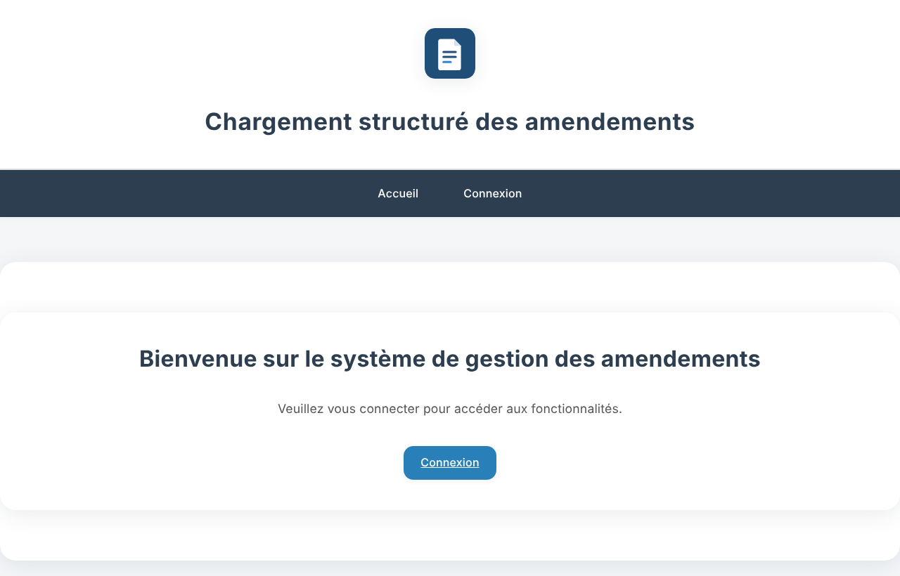
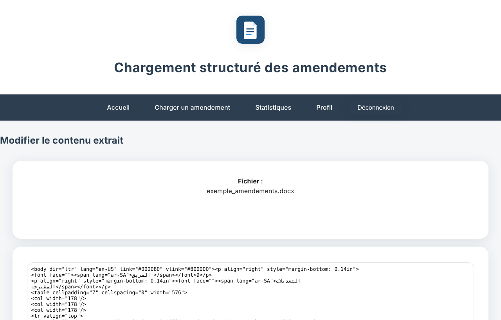
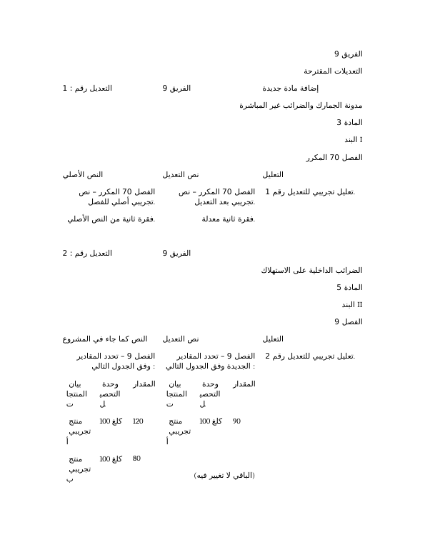
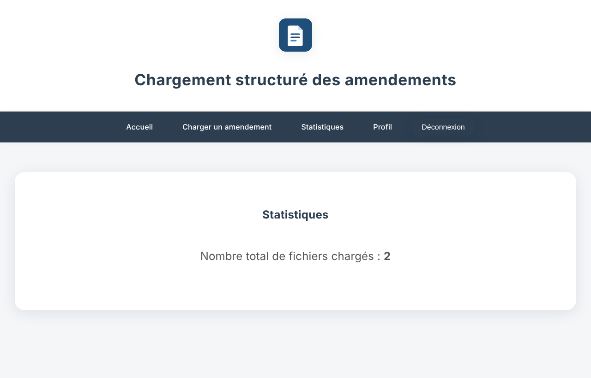

<div align="center">


# PLF Amendements Manager

**Import Finance Bill amendments written in Arabic Word documents, detect their fields with AI, and store them in a database.**

[](https://github.com/axhraf40/gestion-amendements/actions/workflows/tests.yml)


[Features](#features) · [How the AI works](#how-the-ai-works) · [Screenshots](#screenshots) · [Getting started](#getting-started) · [Tests](#running-the-tests) · [Security](#security)



</div>

## About

During the preparation of a Finance Bill (*Projet de Loi de Finances*, PLF), parliamentary groups submit their
amendments as Word documents written in Arabic. Each amendment has a header (amendment number, group, type, law,
article, clause, article of the code being modified) followed by a three-column table: original text, amended
text and justification. Re-typing them into a database is slow and error-prone.

This Django application reads those documents, splits them into individual amendments, **uses a language model
to read each header** (checked against rule-based extraction), and stores one structured record per amendment.
Users can then review, edit and export the result.

Built during an internship.

## Features

| | |
|---|---|
| 📄 **Word (.docx) import** | LibreOffice converts the document to HTML, then each amendment is isolated (header + 3-column table, nested tables included) |
| 🤖 **AI field detection** | A chat model (Qwen 2.5 on Hugging Face by default) reads each header and returns the fields as JSON |
| ✅ **Rules as a safety net** | Regex extraction runs in parallel; each field records its value, confidence and method (`ia+regles`, `ia`, `regles`) |
| 🔌 **Free providers** | Hugging Face `InferenceClient`, Groq, OpenRouter or a local Ollama model — or rules only |
| 🗂️ **Structured records** | Number, group, type, law, article, clause, code article, original text, amended text, justification |
| ✏️ **Review & edit** | See the extracted document, edit it, re-run detection on any amendment |
| 🖨️ **PDF export** | PDF of the original document generated with LibreOffice |
| 👤 **User accounts** | Login, profile, password change; each user only sees their own files |
| 📊 **Statistics** | Files per user and detection statistics per file |

## How the AI works

```
 .docx ──► LibreOffice ──► HTML ──► split into amendments
                                        │
                     header text ───────┼──────────────► 3 columns
                          │             │              (original / amended / justification)
              ┌───────────┴──────────┐  │
              ▼                      ▼  │
      LLM (JSON fields)      regex rules│
              └──────► merge ◄───────┘  │
                         │              │
                         ▼              ▼
                 Amendement record in the database
```

1. **Split** — `amendements/extraction.py` walks the document in order. Everything written before a table whose
   header contains *نص التعديل* and *التعليل* becomes the amendment's header; the table's columns become the
   three texts.
2. **Ask the model** — `amendements/huggingface_utils.py` sends only the short header to a chat model with a
   prompt describing the seven fields and two worked examples. The model answers with JSON.
3. **Check with rules** — the same fields are extracted with regular expressions written for this format
   (handles `التعديل رقم : 8`, Eastern Arabic digits, diacritics, `المكرر`, …).
4. **Merge** — when both agree the field gets confidence 0.98 (`ia+regles`); otherwise the AI value is kept and
   the rule value is stored for review. If the AI is unreachable (no key, no network, quota), the rules are used
   alone and the user is told — an upload never fails because of the AI.

| `AI_PROVIDER` | Call | Default model |
|---|---|---|
| `huggingface` | `huggingface_hub.InferenceClient(...).chat_completion(...)` | `Qwen/Qwen2.5-72B-Instruct` |
| `groq` | OpenAI-compatible HTTP | `llama-3.3-70b-versatile` |
| `openrouter` | OpenAI-compatible HTTP | `meta-llama/llama-3.3-70b-instruct:free` |
| `ollama` | local, offline | `qwen2.5:7b` |
| `none` | rules only | — |

More details in [PROJECT_GUIDE.md](PROJECT_GUIDE.md) and [HUGGINGFACE_INTEGRATION.md](HUGGINGFACE_INTEGRATION.md).

## Screenshots

> All screenshots use a **fictional** document generated by `scripts/generate_sample_docx.py`.

| Upload a Word file | Result after upload |
|---|---|
|  |  |

| My files | Detection statistics |
|---|---|
|  |  |

<details>
<summary>More screens (login, home, edit, PDF, dashboard)</summary>

| Login | Home | Edit |
|---|---|---|
|  |  |  |

| PDF export | Dashboard |
|---|---|
|  |  |

</details>

## Tech stack

| Layer | Tools |
|---|---|
| Backend | Python, Django 5 |
| Document conversion | LibreOffice (headless) |
| Parsing | BeautifulSoup, lxml, python-docx |
| AI | Hugging Face `huggingface_hub` (InferenceClient), or any OpenAI-compatible endpoint |
| Database | SQLite (dev), any Django-supported database in production |
| Front end | Django templates, CSS |
| CI | GitHub Actions |

## Project structure

```
gestion-amendements/
├── charge_amendements/     Project settings, URLs, base templates, CSS and logo
├── amendements/            Core app
│   ├── extraction.py       Splits the document into amendments + rule-based detection + merge
│   ├── huggingface_utils.py  AI detector (InferenceClient / HTTP providers)
│   ├── sample_docx.py      Fictional document generator used by the tests
│   ├── views.py, models.py, templates/, tests.py
├── users/                  Profile and password change
├── stats/                  Dashboard
├── scripts/                generate_sample_docx.py
├── docs/screenshots/       Images used in this README
├── .github/workflows/      Continuous integration
├── .env.example            Template for local environment variables (no real values)
└── requirements.txt
```

## Getting started

### 1. Clone and install

```bash
git clone https://github.com/axhraf40/gestion-amendements.git
cd gestion-amendements
python -m venv .venv
# Windows: .venv\Scripts\activate    macOS/Linux: source .venv/bin/activate
pip install -r requirements.txt
```

Install **LibreOffice** (https://www.libreoffice.org). It is found automatically in its default location;
otherwise set `SOFFICE_PATH` in `.env`.

### 2. Configure environment variables

```bash
cp .env.example .env      # Windows: copy .env.example .env
```

- Keep `DJANGO_DEBUG=True` for local development. In production set your own `DJANGO_SECRET_KEY`.
- For AI detection, put your own key in `AI_API_KEY`:
  create a token at https://huggingface.co/settings/tokens → *Fine-grained* → tick only
  **"Make calls to Inference Providers"**. Without a key the app still works with rules only.

### 3. Create the database and a user

```bash
python manage.py migrate
python manage.py createsuperuser
```

### 4. Run

```bash
python manage.py runserver
```

Open http://127.0.0.1:8000 and log in.

### 5. Try it with a sample document

```bash
python scripts/generate_sample_docx.py exemple_amendements.docx
python test_huggingface.py        # checks that your AI key answers
```

Then upload `exemple_amendements.docx` from **Charger un amendement**.

## Running the tests

```bash
python manage.py test
```

26 tests, all on fictional documents generated on the fly (no real document is stored in the repository):

- rule-based detection and AI/rules merging;
- the AI detector with a mocked model: Hugging Face goes through `InferenceClient`, Groq through HTTP, fallback
  when the AI is unreachable or answers nonsense, no call without a key;
- full extraction of the sample documents, field by field, and the three text columns compared with the Word
  file read independently by python-docx (order of nested tables included);
- real uploads through the Django views and what is saved in the database;
- security: access between users, POST-only deletion, sanitising of edited HTML, login required.

To also call your real AI provider: `AI_LIVE_TEST=1 python manage.py test`
(PowerShell: `$env:AI_LIVE_TEST="1"; python manage.py test`).

## Security

- No secrets in the code: settings and the AI key come from environment variables or a git-ignored `.env` file.
- The AI is only called from the backend; the key never reaches the browser.
- The app refuses to start in production (`DJANGO_DEBUG=False`) without a `DJANGO_SECRET_KEY`.
- Users can only view, edit, export or delete their own files (other users get a 404).
- Deleting requires a POST request with a CSRF token.
- Only `.docx` uploads are accepted; HTML edited by users is cleaned of scripts, event handlers and `javascript:` URLs.
- Uploaded documents, the database and `.env` are git-ignored.

## License

[MIT](LICENSE)
